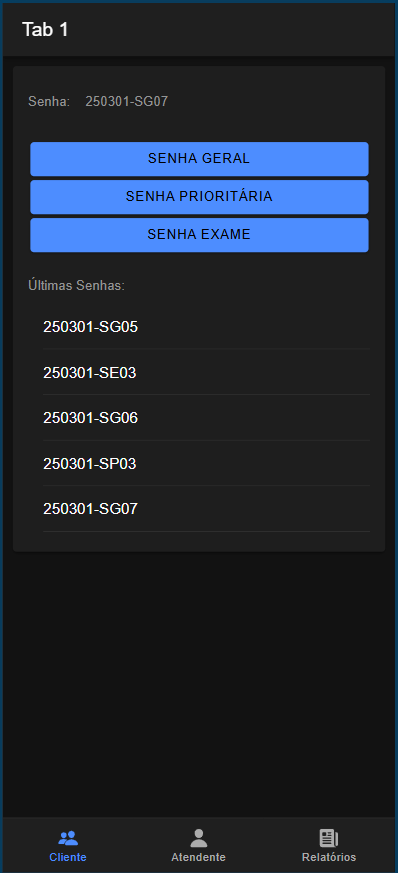
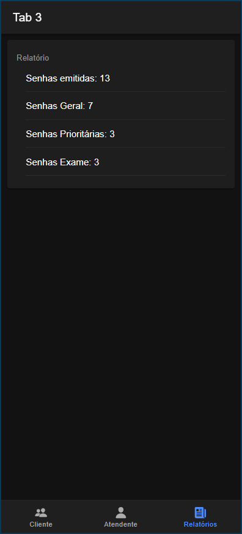

# Sistema de Controle de Atendimento

Este projeto é um sistema de controle de atendimento, baseado no conceito de "tickets" ou "chamados". A solução gerencia a emissão de senhas prioritárias, gerais e para retirada de exames, organizando o fluxo de atendimento.

Desenvolvido com Ionic + Angular.

# Imagens

### Tela de Geração de Senhas para o Cliente



### Tela de Relatórios de Senhas Geradas



#### 1. Pré-requisitos

Certifique-se de ter instalado:
- [Node.js](https://nodejs.org/) (versão recomendada LTS)
- [Ionic CLI](https://ionicframework.com/docs/cli) (Interface de linha de comando do Ionic)

#### 2. Instalando dependências

Agora, instale as dependências:

```bash
npm install 
```

#### 3. Rodando o Projeto

Para rodar o projeto, execute o código:

```bash
ionic serve
```